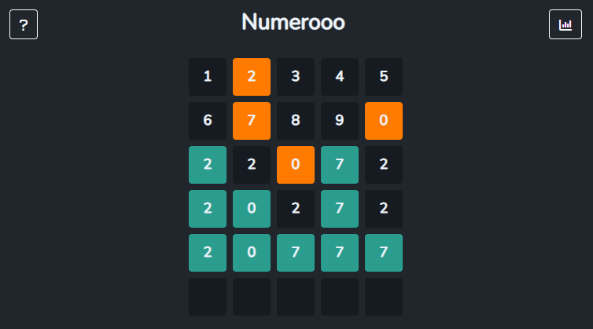

<h1 align="center">Numerooo</h1>

O Numerooo é um jogo em que você deve descobrir um número aleatório. Após cada tentativa, as dicas ajudam você a se aproximar do número correto.

	

 

## 💻 Tecnologias

Esse projeto foi desenvolvido com as seguintes tecnologias:

- [Bootstrap](https://getbootstrap.com/)
- [React](https://reactjs.org)
- [TypeScript](https://www.typescriptlang.org/)
- [Vite](https://vitejs.dev/)

## 🔗 Acesso ao projeto

Você pode acessar o projeto clicando [aqui](https://numerooo.vercel.app/).

---

Desenvolvido por Tiago Faria.